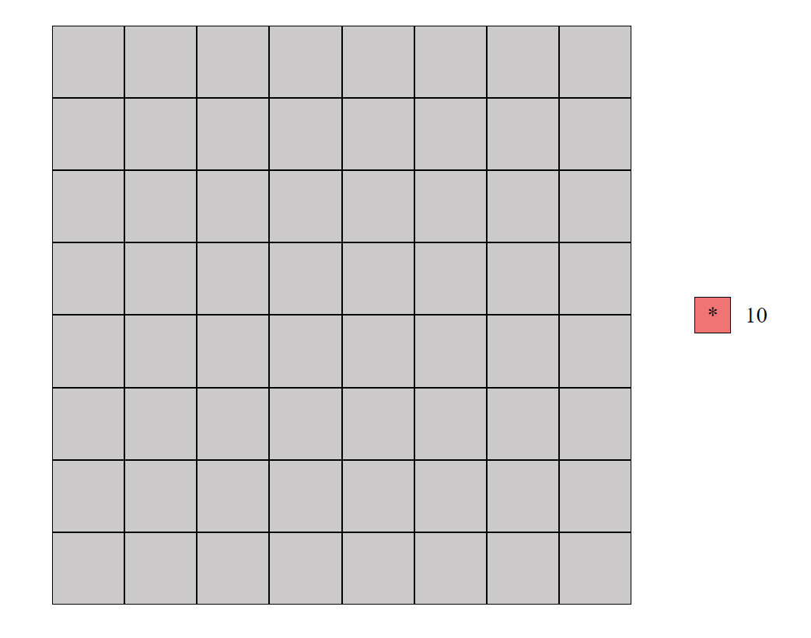

# Saper (03.2023)
Uproszczona wersja gry Saper. Saper to popularna gra jednoosobowa polegająca na tym, że użytkownik (tak jak prawdziwy saper) musi rozminować całe pole o zadanej wielkości, ale dodatkowo jeszcze posiada informacje o całkowitej liczbie postawionych min. Na początku losowane są pozycje min, a następnie ustalane odpowiednie numery pól. Numerem pola jest liczba sąsiadujących min z tym polem np. jeśli dane pole sąsiaduje z 3 minami, wtenczas pole to będzie przyjmowało liczbę 3.

Aplikacja została wdrożona w serwisie Netlify i jest dostępna 24/7 pod następującym adresem adresem:
https://saperv2.netlify.app/.

## Wymagania funkcjonalne:
* Jeden poziom trudności - łatwy (rozmiar planszy 8x8 oraz 10 min),
* Stawianie flag,
* Odkrywanie pól poprzez kliknięcie w nieodkryte pole,
* Odkrywanie pól poprzez kliknięcie w odkryte pole,
* Licznik pozostałych flag do umieszczenia,
* Możliwość rozpoczęcia nowej gry po porażce albo zwycięstwie.

## Technologie:
* JavaScript (biblioteka React),
* HTML,
* CSS,
* Canvas.

### Okrywanie pól
Standardowym dodatkowym mechanizmem w odkrywaniu pól jest automatyczne odkrywanie sąsiednich pustych pól. Jeśli użytkownik kliknie w pole, które nie sąsiaduje z żadnymi minami (puste pole), wtenczas odkrywane są sąsiednie pola do momentu, aż na planszy nie będzie się znajdowało odkryte puste pole.

## Zrzuty ekranu:

Wygląd pustej planszy:

    

`

Częściowo wypełniona plansza:

    

Wygrana:

    

Przegrana:

    

    

Rozpoczęcie nowej gry:

    

